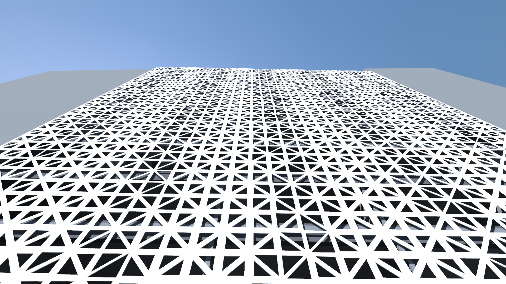

# Tiling Facade Sketchbook

This Algorithmic Design (AD) Sketchbook visually documents the creative process behind the development of a parametric facade envelope for an office building in Avenida da República, Lisbon, Portugal, whose design is inspired by triangular tiling techniques. Triangular-shaped tiles of different sizes and opacity levels are used to create a visually interesting/dynamic geometric pattern that, at the same time, shades the building’s inside spaces from the intense natural daylight typical of southern European countries.

This project was developed using the [Julia programming language](https://julialang.org/) and the Khepri AD tool, running on the [Jupyter notebook](https://jupyter.org/). Currently, the [Binder](https://mybinder.org/) viewer for Jupyter does not have a Julia Kernel available online. To run this AD Sketchbook interactively you must install IJulia on your computer. Use the saved screenshots to confirm that the program is yielding the expected results. Alternatively you may simply browse through the final version of the AD Sketchbook on Binder ([here](https://nbviewer.jupyter.org/github/KhepriNotebook/FacadeTiling/blob/master/Facade_tiling.ipynb)) or here on GitHub by opening the Facade_tiling.ipynb file.

